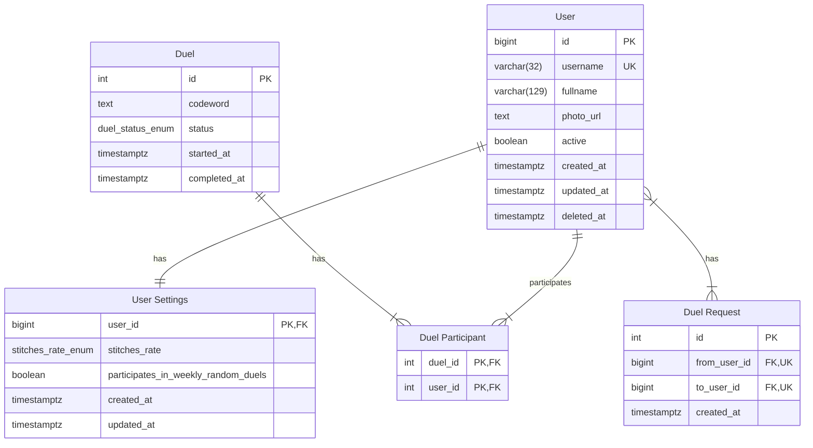

# Database Schema

```mermaid
erDiagram
  "User" {
    bigint id PK
    varchar(32) username UK
    varchar(129) fullname
    text photo_url
    boolean active
    timestamptz created_at
    timestamptz updated_at
    timestamptz deleted_at
  }

  "User Settings" {
    bigint user_id PK, FK
    stitches_rate_enum stitches_rate
    boolean participates_in_weekly_random_duels
    timestamptz created_at
    timestamptz updated_at
  }

  "Duel" {
    int id PK
    text codeword
    duel_status_enum status
    timestamptz started_at
    timestamptz completed_at
  }

  "Duel Request" {
    int id PK
    bigint from_user_id FK, UK
    bigint to_user_id FK, UK
    timestamptz created_at
  }

  "Duel Participant" {
    int duel_id PK, FK
    int user_id PK, FK
  }

  "User" ||--|| "User Settings" : "has"

  "Duel" ||--|{ "Duel Participant" : "has"
  "User" ||--|{ "Duel Participant" : "participates"

  "User" }|--|{ "Duel Request" : "has"
```
