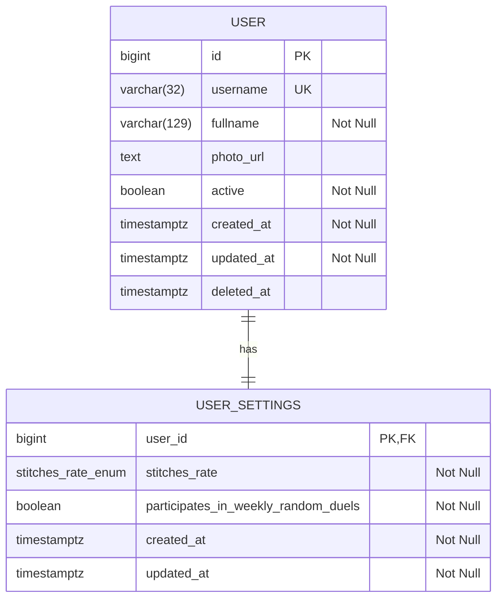

# Database Schema

```mermaid
erDiagram
  USER {
    bigint id PK
    varchar(32) username UK
    varchar(129) fullname "Not Null"
    text photo_url
    boolean active "Not Null"
    timestamptz created_at "Not Null"
    timestamptz updated_at "Not Null"
    timestamptz deleted_at
  }

  USER_SETTINGS {
    bigint user_id PK, FK
    stitches_rate_enum stitches_rate "Not Null"
    boolean participates_in_weekly_random_duels "Not Null"
    timestamptz created_at "Not Null"
    timestamptz updated_at "Not Null"
  }

  USER ||--|| USER_SETTINGS : "has"
```
